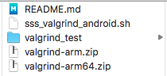

# ValgrindHelperForAndroid
A easy way to using valgrind in Android device.  

# 简介
现在有很多安卓应用因为性能或安全方面原因，会通过JNI调用原生代码。排查原生的C、C++代码时可以使用Valgrind。Valgrind工具包括Memcheck（用于检测C和C++中与内存相关的错误）、Cachegrind（缓存分析器）、Massif（堆分析器）和其他几种工具。Valgrind在Linux开发中应用广泛，但在安卓开发中用起来比较麻烦，官方文档和网上的资料也比较少。这就是这个工具诞生的原因。  
关于Valgrind这个工具，这里就不多做介绍了，大家可以参考[官网](http://valgrind.org)或google.  
  
* 开始之前的说明:    
1.你的安卓设备需要root.（有兴趣完善这个脚本的朋友可以尝试一下把这条限制去掉）  
2.目前，在下面的电脑和安卓设备中测试成功了（欢迎提交Pull request补充），其他PC和设备可能需要修改脚本。如果需要修改脚本，可以参考*原理*中的内容。  
	- `macOS 10.13`    `华为荣耀3C(H30-T00) 4.4.2`

**\*原理和FAQ在[Wiki](https://github.com/sunShuShu/ValgrindHelperForAndroid/wiki)里。**  
**如果你优化了这个脚本的兼容性或修改了bug，（或者有能力把README和Wiki里的内容翻译成英文😂）欢迎提交[Pull request](https://github.com/sunShuShu/ValgrindHelperForAndroid/pulls)❤️**

# 使用
* 将Valgrind安装到安卓设备上：  
	- 1.下载[ValgrindHelperForAndroid.zip](https://github.com/sunShuShu/ValgrindHelperForAndroid/releases)和对应你手机cpu架构的Valgrind压缩包: 
	[ARMv7](https://github.com/sunShuShu/ValgrindForAndroid/raw/master/valgrind-arm.zip), 
	[ARM64](https://github.com/sunShuShu/ValgrindForAndroid/raw/master/valgrind-arm64.zip).  
	- 2.解压ValgrindHelperForAndroid.zip，把Valgrind压缩包放到ValgrindHelperForAndroid文件夹中。就像这样：  
	  
	- 3.在终端中执行下面的命令：  
	```
	cd <ValgrindHelperForAndroid Path>  
	./sss_valgrind_android -i
	```
	- 4.出现下面的提示说明安装成功：  
	```DONE, install valgrind success!```
	
* 用Valgrind启动安卓app:  
	- 1.安装app。建议用ValgrindHelperForAndroid中的valgrind\_test工程测试，make project, debug app。  
	- 2.在终端中执行下面的命令： 
	```
	cd <ValgrindHelperForAndroid Path>
	./sss_valgrind_android.sh
	```  
	- 3.输入Valgrind命令参数。（可以直接输入回车，用Valgrind默认的参数）  
	- 4.输入app的包名。（valgrind\_test工程为com.sunshushu.test）  
	- 5.输入app的MainActivity的名称。（valgrind\_test工程为MainActivity）  
	- 6.输入工程中带符号表的库的路径。（valgrind\_test工程为valgrind_test/app/build/intermediates/cmake/debug/obj/armeabi-v7a）  
	- 7.等待app启动。这个过程可能会很长，设备中途可能会无响应或黑屏，你可以先去喝杯咖啡☕️（**先不要关闭终端**）  
	- 8.测试app。valgrind_test中，点击app的“MEMORY ISSUES”按钮，会产生3个内存问题。然后点击“EXIT”按钮，**正常退出**app.  
	*(由于Valgrind在应用结束之前要进行一些工作，如果直接**强制关闭**app可能导致内存问题排查不全面，所以这里设计了EXIT按钮。)*
* **强制关闭**app，并从安卓设备取回Valgrind的日志。  
在终端中**继续**执行下面的命令：  
`DONE`  
等待终端中出现下面的提示时，到ValgrindHelperForAndroid文件夹中查看Valgrind日志即可。  
`DONE. Check the log(s) in ...`  
（*如果你在上面的第8步中点击“EXIT”按钮关闭了app，这里的强制关闭不会影响Valgrind彻底排查内存问题。*）   
* 查看日志。在日志中搜索app的包名，看一下是不是有内存问题吧。  
*（日志文件名中的数字是线程ID（PID）。）*
